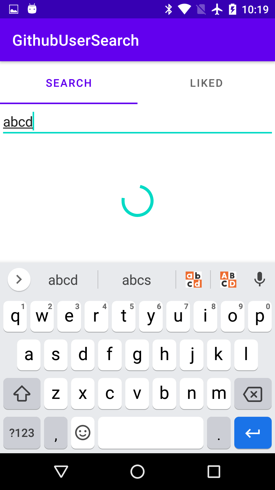

# GithubUserSearch

## Description
GithubUserSearch is a simple app that demonstrates some of the best practices of following components in Android Development:
- MVVM
- Retrofit
- Room
- Recyclerview

## Screenshots
  
 